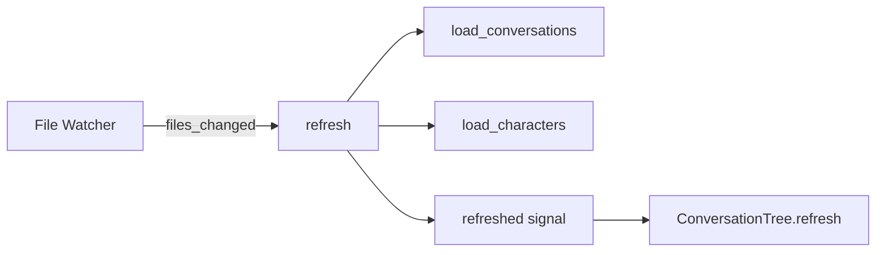

# Core Architecture

The Skein plugin is a Godot 4 `@tool` addon that registers an autoload singleton (`Skein`) to manage characters, conversations, and the runtime dialog canvas.

## Autoload Singleton

`SkeinSingleton.gd` is added as autoload `Skein` when the plugin is enabled (`plugin.gd::_enable_plugin`). It owns these child utilities:

| Child | Purpose |
|-------|---------|
| `Utils` | Node reparenting, signal connection helpers, child traversal |
| `Files` | JSON/Yarn I/O, directory scanning, path normalization; `ensure_prefix()` utility |
| `Yarn` | Convert dictionary ↔ Yarn text format |
| `Sandbox` | Expression evaluation with injected locals |
| `Watcher` | File-system polling for hot-reload |
| `SkeinCanvas` | In-game CanvasLayer hosting DialogBox and popups |

## Refresh Lifecycle



- `load_conversations()` populates `conversations` and `_conversations` by scanning `Files.conversation_prefix` for `.yarn` and `.json`.
- `load_characters()` scans `res://characters/` for `.tscn`, instantiates them, and registers by `name`.
- The `refreshed` signal causes `ConversationTree` and `SkeinEditor` to update.

## Key Data Maps

```gdscript
var characters := {}        # name → Character instance
var conversations := {}     # name → absolute path
var _conversations := {}    # lookup by file, basename, basefile, etc.
```

## Path Handling

`Files.prefix` is `user://` on HTML5, `res://` otherwise.
`Files.ensure_prefix(path)` adds the prefix when missing so editor and runtime paths stay consistent.

## File I/O

`save_conversation(path: String, data: Dictionary)` persists conversation nodes to disk. As of recent changes, it only guards against `null` (not `{}`), trusting the caller to decide what is save-worthy. If the path ends with `.yarn`, the data is handed to `Yarn.save_yarn()`.

## Watcher

`Watcher.gd` polls registered directories in `_process` in steps of `scan_step` files per frame. It emits:
- `files_created(files)`
- `files_modified(files)`
- `files_deleted(files)`
- `files_changed()` (aggregated)

Scanned directories are stored as absolute paths (globalized from `res://` / `user://`).

## Related Lodes
- [dialog-runtime.md](../dialog/dialog-runtime.md) — how the runtime interprets loaded conversations
- [file-formats.md](../formats/file-formats.md) — how conversations are persisted
- [visual-editor.md](../editor/visual-editor.md) — how the editor reads and writes these maps
