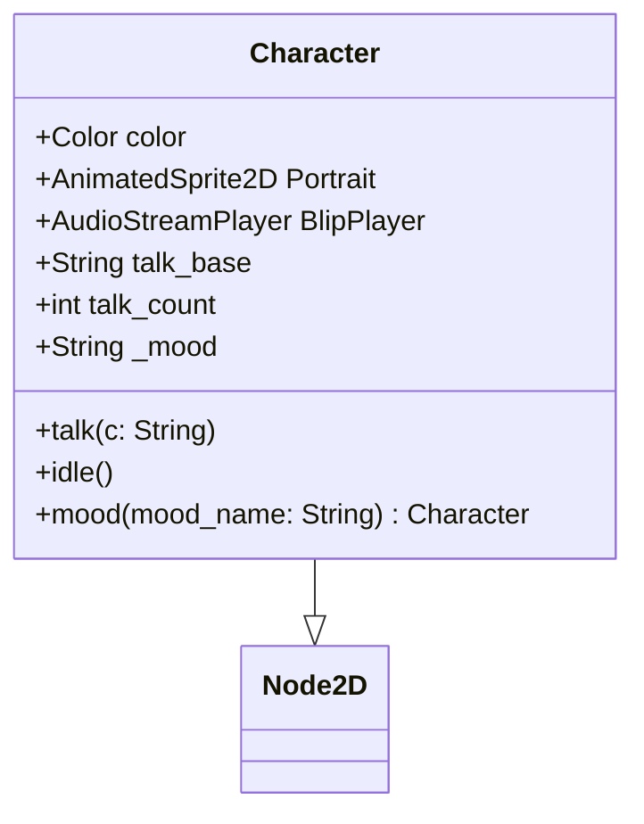

# Characters

Characters are `Node2D` scene instances that live in `Skein.characters` — a dict keyed by node name. They serve two purposes: **dialog presentation** (portrait animation, talk blips, mood state, name color) and **game-state access** (reachable from eval contexts, can carry relationship values, quest state, custom methods).

## Current Structure



**File**: `characters/Character.gd` (extends `Node2D`, should be `class_name SkeinCharacter`)

Needs `class_name SkeinCharacter` — not `Character`, which would squat the global namespace. Plugins must prefix their class names to avoid collisions with game code and other plugins.

**Scene children**: `Frame` (AnimatedSprite2D), `Portrait` (AnimatedSprite2D), `BlipPlayer` (AudioStreamPlayer)

**Isotope adds**: `DialoguePane` (Node2D instance) — phone-style dialog frame overlay. Currently dead weight; `reset_pane()` is never called from game code.

## Loading

`SkeinSingleton.load_characters()` scans `res://characters/` for `.tscn` files, instantiates each, adds to tree hidden, registers by `name` property:

```gdscript
for file in Files.get_all_files('res://' + Files.characters_path, '.tscn'):
    var c = load(file).instantiate()
    characters[c.name] = c
    add_child(c)
    c.hide()
```

All characters are always in the tree. A `Watcher` monitors the directory and triggers `refresh()` → `load_characters()` on file changes.

## Speaker Detection Syntax

The `Name: text` prefix triggers character lookup in `Skein.characters`:

| Syntax | Effect |
|--------|--------|
| `Ash: Hello` | Speaker = Ash, portrait reparented, color applied |
| `Ash.mood("happy"): Hello!` | Evaluates `Ash.mood("happy")` silently, then speaker = Ash |
| `Unknown: Hello` | Name not in characters → treated as plain text, no speaker |

Dot notation calls `_evaluate()` on the part before `:`, then takes the first segment as the character name. This means any character method can be called in the speaker prefix — `Ash.mood("angry")`, `Ash.set_color(...)` etc.

`mood()` returns `self` for chaining. In the speaker prefix the return value is discarded (evaluated as a silent `{}` block). In a `{{ }}` block it would print the node's `str()` representation — not useful.

## Runtime Usage (DialogBox Legacy)

1. Speaker detected from `Name:` prefix
2. Character node **reparented** from Skein autoload into DialogBox's `portrait_container`
3. Previous speaker's children hidden, new speaker `.show()` + `.idle()` called
4. Per typed character: `speaker.talk(c)` — advances portrait frame, plays blip
5. At line end: `speaker.idle()` — switches to idle animation
6. `speaker.color` applied to name/text outline colors

## Eval Context Access

`Sandbox.get_locals()` injects every character as a named local:

```gdscript
for c in Skein.characters:
    _locals[c] = Skein.characters[c]
```

This means `{Ash.color}`, `{Ash.mood("happy")}`, and custom game properties like `{Ash.relationship}` all work inside `{}` / `{{}}` blocks. **Name collision risk**: a character named `dialog`, `scene`, or `caller` would shadow the engine's injected locals.

## Known Problems

- **Prototype that never graduated** — Character.gd was the first pass for Isotope. It works for a single game but isn't a standard. No `class_name`, inconsistent base classes (Pico extends Control, Charli has no script), dead weight (DialoguePane), inconsistent child node names.
- **No `class_name`** — needs `class_name SkeinCharacter`. Plugins must prefix class names to avoid polluting the global namespace (e.g., `Config` from some random plugin would break any game with its own Config). Pico extends `Control` instead of `Node2D`. Charli has no script at all.
- **All characters always instantiated** — every `.tscn` is loaded, instantiated, and added to the tree at startup. No lazy loading.
- **Reparenting = single occupancy** — only one DialogBox can show a character at a time. Two simultaneous dialogs would fight over reparenting.
- **DialoguePane is dead weight** — included in every Isotope character scene but never used.
- **`character_map_path` is dead code** — `SkeinEditor.character_added()` writes to `other_characters.json` but `load_characters()` doesn't read it.
- **Inconsistent child node names** — Pico names portrait `AnimatedSprite2D` instead of `Portrait`, some characters name frame `Pane` instead of `Frame`.
- **No management UI** — no editor panel for creating or editing characters.

## Game-State Extension (Design Intent)

Characters should carry game state accessible from dialog — relationship values, quest flags, inventory, etc. A game dev would add custom properties or methods to the character script:

```gdscript
# In your character script:
var relationship := 0
var met := false

func befriend(amount := 1):
    relationship += amount
    return self
```

Then in dialog: `Ash.befriend(5): I like you!` or `{Ash.relationship}`. This needs the quest tracking system (not yet built) to be fully useful.

## Files

- `characters/Character.gd` — base character script (56 lines)
- `characters/Character.tscn` — base character scene
- `characters/[Name]/[Name].tscn` — individual character scenes (7 in Skein, ~12 in Isotope)
- `characters/DialoguePane.tscn` / `.gd` — Isotope phone dialog overlay (unused)
- `characters/64xportrait_frame.png` — shared portrait frame graphic
- `addons/skein/SkeinSingleton.gd` — `load_characters()`, `Skein.characters` dict
- `addons/skein/engine/DialogEngine.gd` — `_detect_speaker()`, ACTOR_JOINED, SPEAKER_CHANGED effects
- `addons/skein/utils/Sandbox.gd` — injects `Skein.characters` into eval locals

## Related Lodes

- [runtime-engine.md](runtime-engine.md) — DialogEngine effect stream
- [sandbox.md](sandbox.md) — expression evaluation, UserContext
- [core-architecture.md](../core/core-architecture.md) — SkeinSingleton, file loading