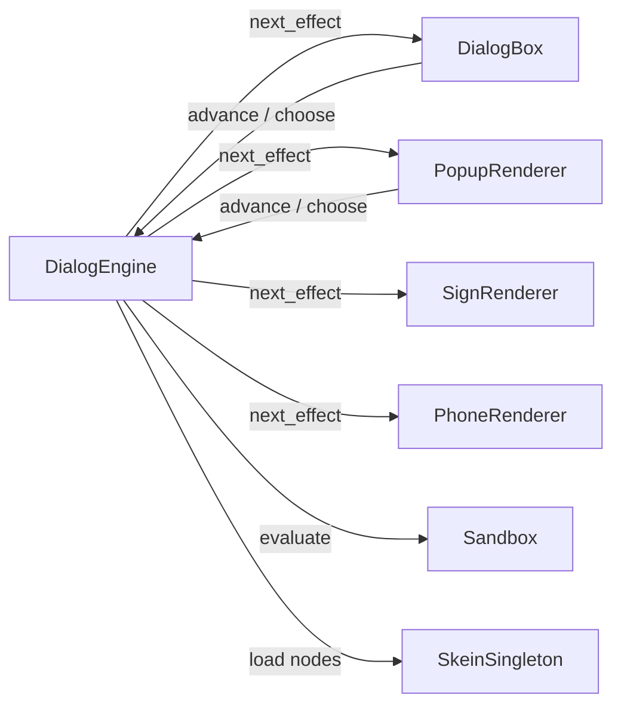

# Dialog Engine

`SkeinDialogEngine` (`addons/skein/engine/DialogEngine.gd`) is the stateful conversation interpreter. It produces a pull-based stream of `SkeinDialogEffect` objects via `next_effect()`. Anything that consumes this stream is a renderer — no base class required, just convention.

## Architecture



## State Machine

| State | Meaning |
|-------|---------|
| `IDLE` | Not started |
| `LINE_ACTIVE` | Scanning `_line` for effects |
| `WAITING_INPUT` | Line fully typed, waiting for user input |
| `CHOOSING` | Choices available, waiting for selection |
| `YIELDING` | Paused for external signal (future) |
| `DONE` | Conversation complete |

## Effect Stream

Renderer calls `next_effect()` repeatedly. The engine has no signals — all communication flows through effects.

### Display Effects (may block renderer loop)

| Type | Value | Renderer Action |
|------|-------|-----------------|
| `CHAR` | Single character | Type one char, start timer, return |
| `PAUSE` | Duration (float) | Start pause timer, return |
| `INSTANT` | Text (BBCode, pipe chunk) | Append immediately, loop |
| `LINE_END` | Null | Show next indicator, return |

### Choice Effects (block renderer loop)

| Type | Value | Renderer Action |
|------|-------|-----------------|
| `CHOICES` | Dict of choices | Build buttons, return |

### Directive Effects

| Type | Value | Renderer Action |
|------|-------|-----------------|
| `DIRECTIVE` | Dict (show, hide, speed, set_name, etc.) | Apply UI effect, loop |

### Metadata Effects (non-blocking, renderer loop continues)

| Type | Value | Purpose |
|------|-------|---------|
| `SPEAKER_CHANGED` | `{new_name, prev_name}` | Character speaking changed |
| `NODE_STARTED` | node_id | New conversation node entered |
| `LINE_STARTED` | `{node_id, line_number}` | New line began (for highlighting) |
| `ACTOR_JOINED` | actor Node | Character portrait appeared (first time) |

### Terminal

| Type | Value | Renderer Action |
|------|-------|-----------------|
| `DONE` | Null | Hide dialog, cleanup |

### Effect Ordering

Metadata effects are queued in `_pending_effects` and drained before line-scanning effects. A typical sequence for one line:

```
NODE_STARTED → LINE_STARTED → SPEAKER_CHANGED → CHAR* → LINE_END
```

The renderer loop uses `continue` on metadata effects — they never block.

### Fast-Forward

Renderer cancels timers and calls `next_effect()` in a loop. Only `CHAR` and `PAUSE` cause the loop to return; all other effects are consumed immediately or loop.

## No Signals

The engine has **zero signals**. All communication is through the effect stream. This was a deliberate design decision: the engine's only API surface is `next_effect()`. Renderers are defined by convention — anything that holds an engine reference and consumes effects.

## Example Renderer Loop (pseudocode)

```gdscript
func _process_effects():
    while true:
        var effect = engine.next_effect()
        match effect.type:
            CHAR:
                text_box.text += effect.value
                _start_typing_timer()
                return
            PAUSE:
                _start_typing_timer(effect.duration)
                return
            INSTANT:
                text_box.text += effect.value
                continue
            DIRECTIVE:
                _apply_directive(effect.value)
                continue
            SPEAKER_CHANGED:
                _update_speaker(effect.value)
                continue
            NODE_STARTED, LINE_STARTED, ACTOR_JOINED:
                continue  # ignore or handle
            CHOICES:
                _display_choices(effect.value)
                return
            LINE_END:
                next_indicator.visible = true
                return
            DONE:
                hide()
                return
```

## Inline Syntax Handling

Block delimiters erase the original text from `_line` and replace it inline:

- `{{expr}}` → replace block with result string (empty string when `exec=false`)
- `{expr}` → erase block, continue scanning (skipped when `exec=false`)
- `<<directive>>` → parse and apply; visual directives produce DIRECTIVE effect
- `[[opt1|opt2]]` → pick random, replace block
- `[bbcode]` → INSTANT effect with the full tag
- `|chunk|` → INSTANT effect
- `_` → PAUSE(0.25)
- `\x` → CHAR with escaped character
- `\` at end of line → sets `continue_line=true`, emits empty INSTANT effect

### Scanner Cursor Contract

Replacement scanners (`_scan_double_brace`, `_scan_single_brace`, `_scan_directive`, `_scan_inline_random`) either return a non-null effect (which the caller returns immediately) or return null. When returning null, `_cursor` is already positioned where scanning should resume — the caller must NOT increment `_cursor`. The `while` loop in `next_effect()` uses `continue` to restart scanning.

If `_scan_single_brace` evaluates an expression that triggers `jump_to()` (e.g. `{jump("Node")}`), the `_line` and `_cursor` are replaced by the new node's text. The scanner detects this by comparing `_line` before and after evaluation, and resets `_cursor = 0` so scanning begins at the start of the new node's text.

### `exec=false` Behavior

When `<<exec false>>` is processed, subsequent `{ }` and `{{ }}` blocks are not evaluated — they're left as literal text visible to the reader. This is essential for the graph editor preview, which can't access game-state references like `caller` and `scene`.

- `{{expr}}` → emitted as INSTANT effect containing the raw `{{expr}}` text
- `{expr}` → emitted as INSTANT effect containing the raw `{expr}` text

The braces are emitted as INSTANT (not typed out character by character) so they don't trigger the `{{ }` / `{ }` scanner and cause infinite re-scan loops.

## Public API

```gdscript
engine.start(conversation_string, options)
engine.advance()           # Next line after LINE_END
engine.choose(key)          # Select choice
engine.jump_to(node_id)     # Jump to node
engine.stop()               # End conversation
engine.next_effect()        # Pull next SkeinDialogEffect
engine.set_speed(value)     # Called from Sandbox
```

## Expression Evaluation (Sandbox)

`_evaluate()` injects three temp locals into `Skein.Sandbox`:

| Local | Value | Purpose |
|-------|-------|---------|
| `caller` | `options.caller` (Node) | The NPC/prop that triggered the dialog |
| `dialog` | `self` (engine) | Allows `jump()` and `speed()` calls from expressions |
| `scene` | `caller.owner` or null | The level/scene owning the caller |

It also defines convenience methods in the EvalContext: `speed(val)` (calls `dialog.set_speed`), `jump(node)` (calls `dialog.jump_to_from_eval`), and `timer(duration)` (creates a SceneTreeTimer).

`jump()` should be used in `{ }` (silent) blocks, not `{{ }}` — it returns null, which would insert `"<null>"` into display text.

`caller.owner` must be explicitly set — Godot does not auto-assign `owner` when adding children via code. Test fixtures use custom classes (`TestCaller`, `TestScene`) with custom properties (`npc_name`, `scene_label`) instead of `name`, since `name` conflicts with Node's built-in.

## Example Renderers

Four example renderers in `addons/skein/renderers/`. All consume the effect stream via `_process()` — no base class, no inheritance required, just convention.

| Renderer | Class | Behavior |
|----------|-------|----------|
| **DialogBox** | `SkeinDialogBox` | Full-screen modal. Typewriter text, choices, speaker name, portrait reparenting, fast-forward on accept. |
| **PopupRenderer** | `SkeinPopupRenderer` | Floating label. No portrait, no choices, no name. Text types in then auto-advances after timeout (3s). Enforces `length` limit if not set. |
| **SignRenderer** | `SkeinSignRenderer` | World-space auto-scroll (Node2D). No typewriter — drains effects instantly, appends lines with `\n`. No choices, no portrait. Stays visible after DONE (game code hides it). |
| **PhoneRenderer** | `SkeinPhoneRenderer` | Side-screen non-modal. Portrait + text + choices, but game continues running. Only responds to input when focused. `dismiss()` method to close early. |

All renderers follow the same pattern:
1. Hold an `engine` reference
2. Call `engine.next_effect()` in `_process()`
3. Match effect type and update UI
4. Continue on metadata effects, block on CHAR/PAUSE/LINE_END/CHOICES/DONE
5. Call `engine.advance()` / `engine.choose()` on user input

## Files

- `addons/skein/engine/DialogEngine.gd` — the engine class (`class_name SkeinDialogEngine`)
- `addons/skein/engine/DialogEffect.gd` — effect type enum and value (`class_name SkeinDialogEffect`)
- `addons/skein/renderers/SkeinDialogBox.gd` — full-screen modal example renderer
- `addons/skein/renderers/SkeinPopupRenderer.gd` — floating label example renderer
- `addons/skein/renderers/SkeinSignRenderer.gd` — world-space sign example renderer
- `addons/skein/renderers/SkeinPhoneRenderer.gd` — non-modal phone example renderer
- `tests/engine.test.gd` — 41 engine tests (GUT, all passing)
- `tests/engine_extended.test.gd` — 37 extended engine tests (GUT, all passing)
- `tests/sandbox.test.gd` — 14 sandbox tests (GUT, all passing)
- `tests/renderers.test.gd` — 13 renderer tests (GUT, all passing)
- `tests/conversations/engine_*.yarn` — test conversation fixtures

## Test Execution

```bash
/home/daelon/godot/godot4 --headless -s addons/gut/gut_cmdln.gd \
  -gconfig=.gut_editor_config.json -gexit
```

## Related Lodes

- [dialog-runtime.md](dialog-runtime.md) — old monolith assessment
- [core-architecture.md](../core/core-architecture.md) — SkeinSingleton, file loading
- [plans/dialog-engine-extraction.md](../plans/dialog-engine-extraction.md) — the extraction plan