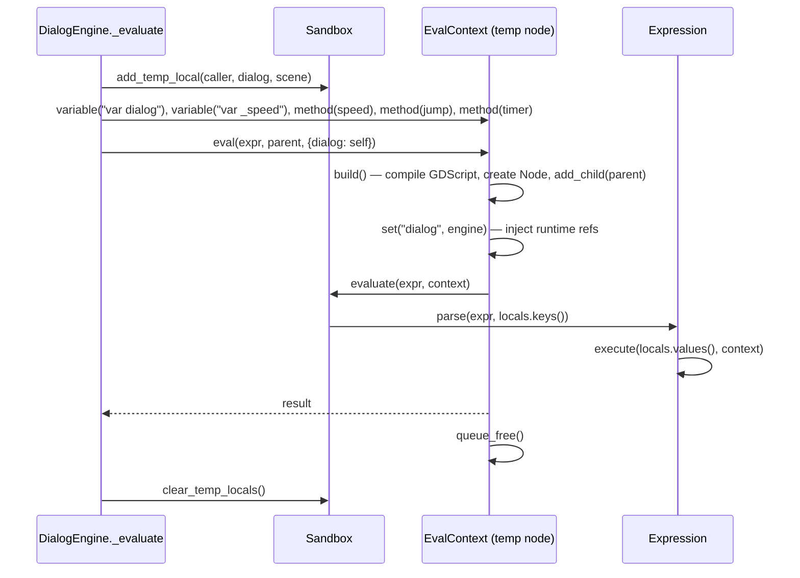

# Sandbox (Expression Evaluator)

`Sandbox` (`addons/skein/utils/Sandbox.gd`) wraps Godot's `Expression` class for the dialog engine. Its job: evaluate inline expressions like `{1 + 1}` or `{{caller.health}}` inside conversation text.

## Architecture

Godot's `Expression` only resolves bare names through the context object's methods. The EvalContext script is rebuilt per eval so any consumer can stamp their own variables and methods onto it before evaluating. The engine is one consumer; game code is another — you can add un-namespaced helpers available inside `{blocks}` without modifying Skein source:

```gdscript
# In your game code, before the engine evaluates:
var ctx = Skein.Sandbox.get_context()
ctx.variable("var inventory  # set via props")
ctx.method("func has_item(name):", ["return inventory.has(name)"])
ctx.method("func count_item(name):", ["return inventory.count(name)"])
Skein.Sandbox.add_temp_local("ctx", ctx)
```



## Two-Layer Locals

| Layer | Dict | Scope | Clear Method |
|-------|------|-------|-------------|
| Persistent | `locals` | Entire conversation | `clear_locals()` |
| Temp | `temp_locals` | Single `_evaluate()` call | `clear_temp_locals()` |

`get_locals()` merges both (temp overrides persistent) plus `Skein.characters`. The engine calls `clear_temp_locals()` after every `_evaluate()` call.

## Engine Injection

`_evaluate()` injects three temp locals:

| Name | Value | Purpose |
|------|-------|---------|
| `caller` | `options.caller` (Node) | NPC/prop that started the dialog |
| `dialog` | `self` (engine) | Allows `dialog.speed`, `dialog.set_speed()` etc in expressions |
| `scene` | `caller.owner` or null | Level/scene owning the caller |

It also injects convenience methods on the EvalContext: `speed(val)`, `jump(node)`, `timer(duration)`.

**Important:** `caller.owner` must be explicitly set — Godot doesn't auto-assign `owner` when adding children via code.

## EvalContext Lifecycle

1. Consumer calls `ctx = Skein.Sandbox.get_context()` → fresh `EvalContext`
2. Consumer calls `ctx.variable()`, `ctx.method()` to stamp methods/vars onto the script
3. Consumer calls `ctx.eval(expression, parent, props)`:
   - `build()` compiles the GDScript, creates a Node, calls `add_child(parent)`
   - `set(key, value)` for each prop — injects runtime object references that method bodies need
   - `Skein.Sandbox.evaluate()` runs `Expression.execute(_locals, context)`
   - The context node is `queue_free()`'d
4. Engine calls `Skein.Sandbox.clear_temp_locals()`

**Why `props`, not Expression locals:** Expression input locals (the names passed to `parse()`) are only visible inside the expression scope — not inside method bodies on the context object. If `func speed(value)` calls `dialog.set_speed(value)`, `dialog` must be a property on the EvalContext node, not just an Expression input. Declare `var dialog` uninitialized in the script (initializers run during `_init()` before tree entry, so `var dialog = self.get_parent()` would be null), then after `add_child`, call `node.set("dialog", engine)` to fill it in.

**Game code extensibility:** `UserContext` is a lightweight config object that game code sets up once in `_ready()`. Its variables and methods are merged into every EvalContext build before per-eval (engine) additions:

```gdscript
# In your game's _ready():
var uc = Skein.Sandbox.UserContext.new()
uc.variable("var inventory  # set via props")
uc.method("func has_item(name):", ["return inventory.has(name)"])
uc.method("func count_item(name):", ["return inventory.count(name)"])
Skein.Sandbox.user_context = uc
Skein.Sandbox.user_props = {"inventory": player_inventory}
```

Runtime object references that method bodies need go in `user_props` — they're `set()` on every built context after `add_child`. Same pattern as the engine's per-eval `props`: declare the var uninitialized (`var inventory  # set via props`), then `user_props["inventory"]` fills it in.

The merge order in `build()` is: user_context variables → user_context methods → per-eval variables → per-eval methods. Per-eval declarations win for same-name entries since they're appended last.

## Known Issues

- **`_assignment_enabled` is a global flag** — safe only because one engine runs at a time
- **`GDScript.new()` + `reload()` on every eval** — necessary (methods/variables change per call) but heavy
- **`Skein.characters` injected into every eval** — a character named `dialog` or `scene` would shadow the engine's injected locals

## Files

- `addons/skein/utils/Sandbox.gd` — the sandbox class (180 lines)
- `tests/sandbox.test.gd` — 14 sandbox tests (GUT, all passing)
- `tests/engine.test.gd` — 41 engine tests including 7 engine+sandbox integration tests

## Related Lodes

- [runtime-engine.md](runtime-engine.md) — DialogEngine that uses the sandbox
- [core-architecture.md](../core/core-architecture.md) — SkeinSingleton, file loading