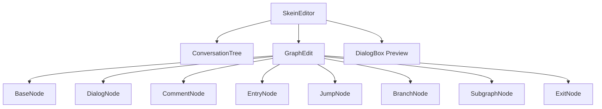
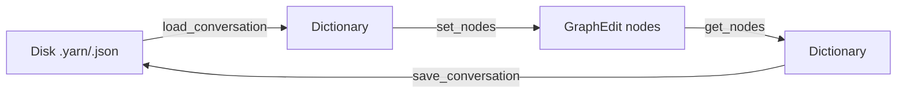

# Visual Editor

Skein provides a custom Godot main-screen panel for visually editing conversations as node graphs. The editor is a `Control` (`SkeinEditor`) that coordinates a file tree, a graph canvas, and a live dialog preview.

## Components

### SkeinEditor

- Coordinates the left panel (`ConversationTree`), the center graph (`GraphEdit`), and the right inspector/`DialogBox` preview.
- Handles folder and conversation CRUD, node focus, and preview playback.
- `save_conversation()` serializes the graph via `GraphEdit.get_nodes()` and calls `Skein.save_conversation()`.
- Editor state (zoom, panel sizes, current conversation, minimap, snap settings) is persisted to `user://skein/editor_data.json`.
- `autosave()` is wired to a Timer.
- `really_delete_conversation()` is now fully implemented (previously a `pass` stub).

### GraphEdit

- Extends Godot's `GraphEdit` with custom node creation, deletion, copy/paste, and zoom handling.
- Emits `zoom_changed(zoom)` when the mouse wheel is used, allowing nodes (e.g., `CommentNode`) to react.

| Node Type | Scene | Key Features |
|-----------|-------|--------------|
| `dialog` | `DialogNode.tscn` | TextEdit, up to 4 conditional choices (`show_choices`), right-slot connections |
| `entry` | `EntryNode.tscn` | Starting point; no special UI |
| `exit` | `ExitNode.tscn` | End-of-conversation marker |
| `branch` | `BranchNode.tscn` | Condition field per output slot |
| `comment` | `CommentNode.tscn` | `GraphFrame`-based group node; draggable container for other nodes; color picker; zoom-aware tooltip |
| `jump` | `JumpNode.tscn` | Target node reference for non-linear jumps |
| `subgraph` | `SubgraphNode.tscn` | Embed another conversation as a sub-graph |

### BaseNode

Abstract base class extending `GraphElement` (not `GraphFrame` — `CommentNode` is the only `GraphFrame`). Provides:
- `data` dict with common fields: `id`, `type`, `name`, `text`, `next`, `default`, `position`, `connections`
- `slot_colors` array for connection coloring
- `get_data()` / `set_data()` serialization round-trip with `var_to_str`/`str_to_var` for `Rect2` data
- Title-bar context menu: **Default** toggle, **Play**, **Copy Path/Name/ID**, **Delete**
- `play_request` signal (added in recent commits) allows playing a specific node from its context menu

### DialogNode

- `Choices` menu toggles `show_choices`; when on, right slots 1-4 are enabled for choice connections.
- Choice data lives in `data['choices']` keyed by slot number `1..4`.

### CommentNode

- Extends `GraphFrame`, making it a container node.
- Features:
  - Color picker (`BGColor`) that updates `tint_color`
  - **`zoom_changed(zoom)`** handler: hides/shows a tooltip label when zoom drops below `0.5`
  - **Group drag**: when a `CommentNode` is dragged, any fully enclosed nodes move with it (`drag_children` map computed in `begin_move()`)
  - `resize_request` support with snapping

### LabelEdit

- A reusable `Control` node used inside graph nodes for inline title editing.
- Double-click a `Label` to switch to a `LineEdit`.
- **Escape** rejects changes; **Enter** accepts.
- Proper `@onready` behavior initialized in `_ready()`.

## Serialization Round-Trip

- `GraphEdit.get_nodes()` iterates `nodes` dict, validates instances, and calls `node.get_data()`.
- `BaseNode.get_data()` converts `position_offset` and `size` into `Rect2` via `var_to_str` for portability.
- `BaseNode.set_data()` decodes `position` (new) or `position_offset` + `size` (legacy) fields.

## Related Lodes
- [core-architecture.md](../core/core-architecture.md) — how `SkeinSingleton` loads/saves conversations
- [dialog-runtime.md](../dialog/dialog-runtime.md) — how the graph content is interpreted at runtime
