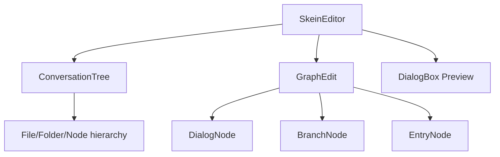
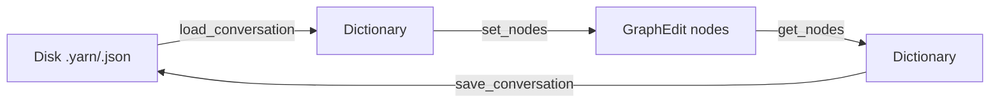

# Visual Editor

Skein provides a custom Godot main-screen panel for visually editing conversations as node graphs.

## Components

### SkeinEditor

- `SkeinEditor.tscn` is instantiated once per editor location (`top` or `bottom`).
- Handles conversation CRUD, folder management, node focus, and preview playback.
- Persists editor state (zoom, panel sizes, current conversation) to `user://skein/editor_data.json`.
- `autosave()` is wired to a Timer; `save_conversation()` serializes the graph to disk.

### ConversationTree

- Tree UI showing folders, `.yarn`/`.json` files, and individual nodes inside each file.
- Right-click context menu for New File, New Folder, Rename, Delete, Run Node, Copy Path.
- Drag-and-drop of files/folders onto folders to move them.
- Emits signals that `SkeinEditor` proxies to `GraphEdit`.

### GraphEdit / Nodes

Nodes extend `BaseNode.gd`. Key types:

| Type | Class | Key Features |
|------|-------|--------------|
| `dialog` | `DialogNode.gd` | TextEdit, up to 4 conditional choices, right-slot connections |
| `entry` | `EntryNode.gd` | Starting point; no special UI |
| `branch` | `Branch.gd` | Condition field per output slot |

`DialogNode` specific behavior:
- `Choices` menu toggles `show_choices`; when on, right slots 1-4 are enabled for choice connections.
- Choice data lives in `data['choices']` keyed by slot number `1..4`.

### Serialization Round-Trip

`GraphEdit.get_nodes()` reads each node’s `data` dict (position, size, text, choices, branches, connections) and returns the same format `Skein` uses for persistence.

## Related Lodes
- [core-architecture.md](../core/core-architecture.md) — how `SkeinSingleton` loads what the graph edits
- [dialog-runtime.md](../dialog/dialog-runtime.md) — how the graph content is interpreted at runtime
