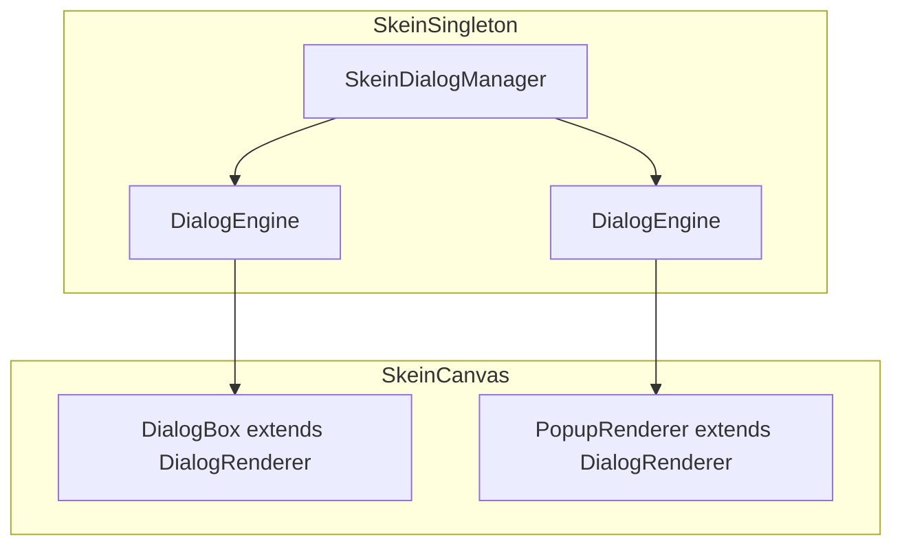

# Dialog Engine / Renderer Extraction Plan

## Context

DialogBox.gd is an 816-line monolith acting as both conversation interpreter and UI renderer. Isotope Ash requires multiple simultaneous dialogs (main overlay + NPC popups), which the current shared-instance model cannot support. Since this is a Godot 4 fork with zero consumers, the refactor is constraint-free.

## Architecture



## Core Design Decision: Pull-Based Instruction Stream

The engine does **not** pre-tokenize and hand off. It exposes a pull-based instruction stream via `next_effect()`. The renderer consumes one effect at a time and returns control, allowing user input to fast-forward mid-line.

This is necessary because mid-line evals (`{Player.gold = 0}`) and directives (`<<jump Node>>`) have side effects that the engine must process inline.

## Effect Types

| Type | Renderer Action | Engine State |
|------|----------------|--------------|
| `CHAR` | Type one character, start timer, return | Advance cursor |
| `PAUSE` | Start pause timer, return | — |
| `INSTANT` | Append full chunk, loop immediately | — |
| `DIRECTIVE` | Apply UI-visible directive (show/hide), loop immediately | — |
| `JUMP` | Clear text, call `_process_effects()` again | Node already switched |
| `LINE_END` | Show next indicator, return for input | — |
| `CHOICES` | Build buttons, return for selection | — |
| `DONE` | Hide self, emit `done`, cleanup | — |

## Renderer Walk Loop

```gdscript
func _process_effects():
    while true:
        var effect = engine.next_effect()
        match effect.type:
            CHAR:
                text_box.text += effect.value
                _start_typing_timer(engine.get_speed())
                return  # Wait for timer or input
            PAUSE:
                _start_typing_timer(effect.duration)
                return
            INSTANT, DIRECTIVE:
                # Apply immediately, loop
                _apply(effect)
                continue
            JUMP:
                _clear_text()
                continue  # New node's effects follow
            LINE_END:
                _finish_line()
                return
            CHOICES:
                _display_choices(effect.value)
                return
            DONE:
                _finish_conversation()
                return
```

## Fast-Forward / Skip Behavior

When user presses **Accept** during typing:

```gdscript
func handle_input(event):
    if line_active:
        text_timer.stop()
        _process_effects()  # Does not return until LINE_END/CHOICES/DONE
```

Because `CHAR` and `PAUSE` are the only types that return mid-loop, draining the stream naturally types all remaining characters instantly (INSTANT chunks stay instant) and lands at the next yield point.

## Mid-Line Eval and the Sharp Chisel

Eval blocks (`{}` silent, `{{ }}` printing) execute inline within `next_effect()` via the Sandbox. The renderer is never aware of side-effect evaluations (camera shakes, state mutations, etc.). It only receives effects for things the **viewer must see**.

Sandbox context is injected per-engine at `start()`:

```gdscript
func _evaluate(input: String):
    var ctx = Skein.Sandbox.get_context()
    ctx.variable('var caller = get_caller()')
    ctx.variable('var scene = get_caller().get_owner()')
    ctx.variable('var dialog = self')  # DialogEngine
    ctx.method('func jump(node):', ['dialog.jump_to(node)'])
    ctx.method('func speed(value):', ['dialog.set_speed(value)'])
    ctx.method('func timer(duration):', ['return get_tree().create_timer(duration)'])
    return ctx.eval(input, self)
```

## Classes

### `DialogEngine` (`Node`)
- Owns conversation state: `nodes`, `current_node`, `current_line`, `cursor`, `speed`, `exec`
- Parses lines, processes inline choices, evaluates `{}` blocks
- Emits: `node_started`, `line_started`, `directive_received`, `choices_available`, `done`, `paused`, `resumed`
- Primary API: `start(conversation, options)`, `advance()`, `jump_to(node)`, `next_effect() -> DialogEffect`

### `DialogRenderer` (`Control`, abstract)
- Owns `DialogEngine` reference
- Receives effect stream via `next_effect()`, drives visual pacing
- Subscribes to engine signals for metadata (speaker changes, node starts)
- Owns `_process_effects()`, `_apply_directive()`, `handle_input()`
- Virtual: `_on_char_typed(c)`, `_on_line_finished()`, `_on_speaker_changed(name)`

### `DialogBox` (`DialogRenderer`)
- Standard full-screen/bottom overlay
- Keeps text typing, BBCode, pipe chunks, pause chars, portrait reparenting
- Uses timers: `text_timer` (per-character), `dismiss_timer` (popup auto-dismiss)
- Child nodes via `find_child()` with descriptive null errors

### `PopupRenderer` (`DialogRenderer`)
- Floating label, no portraits, fewer effects supported
- Auto-dismiss when `LINE_END` + `popup_timeout` > 0
- Positioned over `caller` by `SkeinCanvas._process`

### `SkeinDialogManager` (inside `SkeinSingleton`)
- Dictionary `_engines := {}  # id → DialogEngine`
- `create_engine(caller, conversation, options) -> DialogEngine`
- `get_engine(id)`, `kill_engine(id)`
- Autoclears on `done` signal

## Migration Path

1. Create `DialogEngine` alongside existing `DialogBox`, no rename yet
2. Create `DialogRenderer` base, make `DialogBox` extend it
3. Slowly delegate `DialogBox` methods to the engine
4. When `DialogBox` is only renderer logic, extract into `DialogBoxRenderer`
5. Update `SkeinCanvas` to use `DialogEngine` + renderer pairing
6. Update tests

## Design Invariants

- **Engine is the interpreter.** Renderer is the performer.
- **Effects are pull-based.** The renderer drives pacing.
- **Side effects during typing happen inline in the engine.** The renderer is blind to eval calls.
- **Text file remains source of truth.** No generated intermediate format.
- **DialogBox is a template.** Games subclass `DialogRenderer` for custom UI.

## Related Lodes

- [dialog-runtime.md](../dialog/dialog-runtime.md) — old monolith assessment
- [core-architecture.md](../core/core-architecture.md) — SkeinSingleton and file loading
